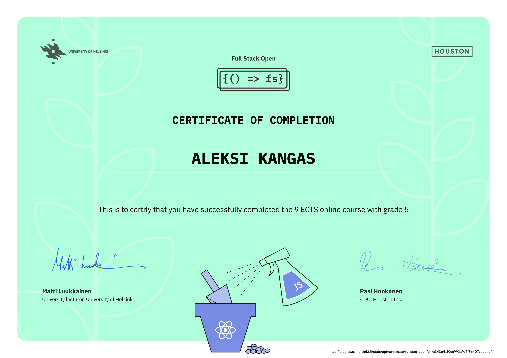

# Full Stack Open 2020 - My Solutions

Full Stack Open 2020 is a MOOC provided by University of Helsinki. (https://fullstackopen.com/en/about)

"Learn React, Redux, Node.js, MongoDB, GraphQL and TypeScript in one go! This course will introduce you to modern JavaScript-based web development. The main focus is on building single page applications with ReactJS that use REST APIs built with Node.js."

This repository contains my solutions for all 9 chapters of the 2020 edition.



Clone using the following command in Bash:
```
git clone https://github.com/aleksi-kangas/Full-Stack-Open-2020.git --recursive
```
